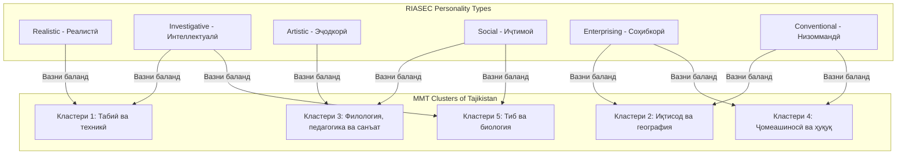

# ЭНСИКЛОПЕДИЯИ МУФАССАЛ ВА ДАСТУРИ ЛЕКСИОНИИ ЛОИҲАИ "MY CAREER" (КАРЕРАИ МАН)
## Роҳнамои Мукаммал барои Моделҳои AI, NotebookLM, Муаррифиҳои Стартапӣ ва Дизайни Визуалӣ

Ин ҳуҷҷат бузургтарин ва муфассалтарин манбаи дониш (Master Knowledge Base) оид ба экосистемаи инноватсионии **"My Career"** мебошад. Он махсус барои боргузорӣ ба системаи **Google NotebookLM** сохта шудааст, то ба шумо аудио-презентатсияҳо, конспектҳо ва саволу ҷавобҳои бениҳоят амиқ ва дақиқро бо забони тоҷикии адабӣ таъмин кунад. Ин дастур тамоми паҳлӯҳои лоиҳаро аз консепсияи иҷтимоӣ ва равоншиносӣ то алгоритмҳои математикӣ, сохтори кодҳо, меъмории AI ва дастурҳои мукаммали дизайни визуалиро дар бар мегирад.

---

## БАХШИ 1: КОНСЕПСИЯИ ЛОИҲА ВА ФАЛСАФАИ ИҶТИМОӢ

Платформаи **"My Career"** ҷавоб ба яке аз муҳимтарин мушкилоти соҳаи маориф ва бозори меҳнат дар Ҷумҳурии Тоҷикистон мебошад. Аксарияти хатмкунандагони мактабҳои миёна ва довталабон касбҳоеро интихоб мекунанд, ки ба шавқ, истеъдод ва хусусиятҳои равонии онҳо мувофиқат намекунанд. Ин боиси афзоиши сатҳи бекорӣ, паст шудани маҳсулнокии меҳнат ва талафи нерӯи зеҳнии кишвар мегардад.

"My Career" ин мушкилотро тавассути **синтези сеҷабҳа** ҳал мекунад:
1. **Диагностикаи Психологӣ:** Муайян кардани намуди равонии корбар бо модели муосири RIASEC.
2. **Ҳамоҳангсозии Маҳаллӣ (ММТ):** Пайваст кардани натиҷаҳои тест ба 5 кластери Маркази Миллии Тестии Тоҷикистон ва ихтисосҳои воқеӣ.
3. **Зеҳни Сунъии Мушовир (AI Advisor):** Пешниҳоди нақшаи инфиродии рушд (Roadmap), чати овозӣ (Whisper) ва муқоисаи касбҳо бо дастгирии моделҳои Llama 3 ва Gemini.

---

## БАХШИ 2: АЛГОРИТМИ ПСИХОЛОГИИ RIASEC ВА ХАРИТАИ МУТОБИҚАТ КАРДАНИ ОН БА КЛАСТЕРҲОИ ММТ

Асоси илмии санҷиши касбӣ дар платформа ба **Модели Психологии Голланд (RIASEC)** такя мекунад, ки шахсиятро ба 6 гурӯҳи асосӣ тақсим менамояд. Барои аввалин бор дар Тоҷикистон, ин холҳо мустақиман ба **5 кластери Маркази Миллии Тестӣ (ММТ)** мутобиқ карда шудаанд.



### 2.1. Таҳлили Амиқи 6 Намуди Равонии RIASEC дар "My Career"

#### 1. R — Реалистӣ (Realistic / Амалӣ)
* **Хусусиятҳо:** Кор бо дастгоҳҳо, мошинҳо, асбобҳо, ҳайвонот ва растаниҳо. Ин намудҳо фаъолияти ҷисмонӣ, кори берун аз офис ва ҳалли мушкилоти амалиро дӯст медоранд. Онҳо амалро аз назария боло мегузоранд.
* **Касбҳои мувофиқ дар Тоҷикистон:** Муҳандиси сохтмон, барномасози сахтафзор (hardware engineer), роҳнамои сайёҳии кӯҳӣ, мутахассиси шабакаҳои энергетикӣ.
* **Мутобиқати асосии ММТ:** **Кластери 1 (Табиӣ-техникӣ)**.

#### 2. I — Интеллектуалӣ / Таҳқиқотӣ (Investigative)
* **Хусусиятҳо:** Таҳлил, таҳқиқоти илмӣ, ҳалли масъалаҳои мураккаби математикӣ ва мантиқӣ. Ин гурӯҳ одамони кунҷков, мустақил ва мутафаккир мебошанд, ки кор бо додаҳо ва формулаҳоро дӯст медоранд.
* **Касбҳои мувофиқ дар Тоҷикистон:** Таҳлилвари додаҳо (Data Analyst), биоинформатик, мутахассиси киберамният, иқтисоддон-таҳлилгар, ҷарроҳ.
* **Мутобиқати асосии ММТ:** **Кластери 1** (барои техникҳо) ва **Кластери 5** (барои табибон ва биохимикҳо).

#### 3. A — Эҷодкорӣ / Артистикӣ (Artistic)
* **Хусусиятҳо:** Озодии баён, тарроҳӣ, санъат, мусиқӣ, нависандагӣ ва эҷоди мафҳумҳои нав. Онҳо аз қоидаҳои сахт ва корҳои мунтазами дилгиркунанда дурӣ меҷӯянд.
* **Касбҳои мувофиқ дар Тоҷикистон:** Дизайнери UI/UX, дизайнери графикии 3D, рӯзноманигори мултимедиа, меъмори биноҳо, тарҷумони бадеӣ.
* **Мутобиқати асосии ММТ:** **Кластери 3 (Филология, педагогика ва санъат)**.

#### 4. S — Иҷтимоӣ (Social)
* **Хусусиятҳо:** Ёрӣ ба дигарон, таълим, машваратдиҳӣ, табобат ва муоширати фаъол. Онҳо одамони дилсӯз, меҳрубон ва ҳамкор мебошанд, ки аз беҳтар кардани ҳаёти одамон лаззат мебаранд.
* **Касбҳои мувофиқ дар Тоҷикистон:** Муаллими инноватсионӣ, равоншиноси оилавӣ, мушовири HR, табиби кӯдакон (педиатр), роҳбари созмонҳои хайриявӣ.
* **Мутобиқати асосии ММТ:** **Кластери 3** (педагогика) ва **Кластери 5** (тиб ва тандурустӣ).

#### 5. E — Соҳибкорӣ (Enterprising / Ташаббускор)
* **Хусусиятҳо:** Роҳбарӣ, идоракунии лоиҳаҳо, фурӯш, маркетинг, таъсир расонидан ба дигарон ва қабули қарорҳои хатарнок. Онҳо одамони дорои нутқи қавӣ, боварибахш ва шӯҳратпараст мебошанд.
* **Касбҳои мувофиқ дар Тоҷикистон:** Менеҷери лоиҳаҳои ТИ (Project Manager), соҳибкори стартап, менеҷери маркетинг, ҳуқуқшиноси тиҷоратӣ.
* **Мутобиқати асосии ММТ:** **Кластери 2 (Иқтисод ва менеҷмент)** ва **Кластери 4 (Ҳуқуқшиносӣ ва ҷомеашиносӣ)**.

#### 6. C — Низоммандӣ / Конвенсионалӣ (Conventional)
* **Хусусиятҳо:** Кор бо ҳуҷҷатҳо, ҷадвалҳо, ҳисобдорӣ ва риояи қатъии низомномаҳо. Онҳо одамони мунтазам, дақиқ ва боинтизом мебошанд, ки ба тафсилот аҳамияти калон медиҳанд.
* **Касбҳои мувофиқ дар Тоҷикистон:** Роҳбари молиявӣ (CFO), муҳосиби муосир, таҳлилвари хатарҳои бонкӣ, мудири базаи додаҳо (DBA).
* **Мутобиқати асосии ММТ:** **Кластери 2** ва **Кластери 4**.

---

### 2.2. Алгоритми Формулавии Гузариши Холҳо ба Кластерҳои ММТ

Ҳангоми супоридани тест, корбар барои ҳар як намуди RIASEC хол мегирад (аз 0 то 100). Система ин холҳоро тавассути коэффисиентҳои вазнӣ ($w$) ба фоизҳои мувофиқати 5 кластери ММТ табдил медиҳад:

* **Кластери 1 (Илмҳои техникӣ):**
  $$\text{Score}_{C1} = 0.50 \times \text{Investigative} + 0.40 \times \text{Realistic} + 0.10 \times \text{Conventional}$$
* **Кластери 2 (Иқтисод ва менеҷмент):**
  $$\text{Score}_{C2} = 0.45 \times \text{Enterprising} + 0.45 \times \text{Conventional} + 0.10 \times \text{Social}$$
* **Кластери 3 (Педагогика ва санъат):**
  $$\text{Score}_{C3} = 0.50 \times \text{Social} + 0.40 \times \text{Artistic} + 0.10 \times \text{Investigative}$$
* **Кластери 4 (Ҳуқуқ ва ҷомеа):**
  $$\text{Score}_{C4} = 0.50 \times \text{Enterprising} + 0.30 \times \text{Social} + 0.20 \times \text{Conventional}$$
* **Кластери 5 (Тиб ва биотехнология):**
  $$\text{Score}_{C5} = 0.55 \times \text{Investigative} + 0.35 \times \text{Social} + 0.10 \times \text{Realistic}$$

Касбҳои дар база мавҷудбуда ба ин кластерҳо пайваст карда шудаанд ва бо ҳамин фоизи мувофиқати ҳар як ихтисос барои корбар худкор ҳисоб карда мешавад.

---

## БАХШИ 3: МЕЪМОРИИ ТЕХНИКИИ СИСТЕМА (FULL-STACK DETAILED SPECS)

Платформаи "My Career" дорои сохтори мустаҳками модулӣ мебошад, ки имкон медиҳад қисмҳои веб, мобилӣ ва сервер бидуни вобастагии сахт аз якдигар кор кунанд.

### 3.1. Frontend (React 19 & Vite)
* **Идоракунии ҳолат (Zustand):** Файли `src/store/authStore.js` ҳолати корбар, токени JWT ва танзимоти профилро идора мекунад. Он сабук буда, маълумотро худкор дар `localStorage` ҳамоҳанг (persist) месозад.
* **Таҷрибаи Визуалӣ (Three.js & Framer Motion):** Эффектҳои олии 3D дар саҳифаи асосӣ ва аниматсияҳои зебои слайд-корт ҳангоми супоридани тест.
* **Харитаи Интерактивӣ (React Leaflet):** Харитаи донишгоҳҳои Тоҷикистон бо нишон додани шаҳрҳои Душанбе, Хуҷанд, Бохтар ва ғайра, ки аз рӯи координатҳо донишгоҳҳоро визуалӣ мекунад.

### 3.2. Backend (NestJS 11 & TypeORM)
Backend ба принсипҳои **SOLID** ва меъмории модулии NestJS такя мекунад:
* **`AuthModule`:** Мудирияти бақайдгирӣ, вуруд ва амнияти паролҳо бо `bcrypt`.
* **`CareersModule`:** Дорои CRUD барои ихтисосҳо, ҷустуҷӯи пешрафта бо филтрҳои кластер ва арзиши таҳсил, инчунин алгоритми `/match` барои мутобиқат.
* **`QuizModule`:** Саволҳои санҷишро идора мекунад ва натиҷаҳоро таҳлил мекунад.
* **`AiModule`:** Ҳамгироӣ бо SDK-ҳои муосири Groq ва Google AI барои чат ва генератори тавсияҳо.
* **`AppointmentModule`:** Сабти навбат бо мутахассисони касбӣ ё машварати AI бо ҳисобкунии вақти интизорӣ.

---

## БАХШИ 4: ИМКОНИЯТҲОИ AI ВА МЕЪМОРИИ ДУГОНА (HYBRID AI ARCHITECTURE)

Лоиҳаи "My Career" аз **меъмории гибридии AI** истифода мебарад, ки устуворӣ ва суръатро ба сатҳи максималӣ мерасонад.

```
+-------------------------------------------------------------+
|                     NestJS AI Service                       |
+-------------------------------------------------------------+
                               |
               +---------------+---------------+
               | (Дархости Чат)                | (Агар Groq Rate Limit ё Хато диҳад)
               v                               v
    +--------------------+           +--------------------+
    |   Groq SDK API     |           |  Google Gemini SDK |
    |  (Llama 3 Model)   |           | (Gemini Pro Model) |
    |   [Асосӣ - Тез]    |           |   [Эҳтиётӣ - Fall] |
    +--------------------+           +--------------------+
```

### 4.1. Кор бо Whisper-Large-V3 (Voice-to-Text бо Муҳити Маҳаллӣ)
Ҳангоми муоширати овозӣ, файли аудиоӣ ба `/api/careers/ask` фиристода мешавад. Барои он ки Whisper забони тоҷикиро дуруст дарк кунад, чунин мантиқ дар сервер амалӣ шудааст:
```typescript
const transcription = await this.groq.audio.transcriptions.create({
  file: fs.createReadStream(filePath),
  model: 'whisper-large-v3',
  prompt: 'ММТ, ихтисос, донишгоҳ, кластер, касб, Тоҷикистон',
  language: 'tg'
});
```
Ин калимаҳои ёрирасон (prompt-hints) фоизи хатогиро дар шинохти овозҳои маҳаллӣ бениҳоят кам мекунанд.

---

## БАХШИ 5: ДАСТУРАМАЛИ ТАРРОҲӢ ВА ПРОМТҲОИ ДИЗАЙНИ СУПЕР-PREMIUM

Барои он ки лоиҳа дорои дизайни **бениҳоят муосир, ояндасоз ва эстетикии бой** бошад, мо промтҳои ҳирфаии зеринро барои моделҳои Midjourney ва DALL-E таҳия намудем.

### 5.1. Промтҳои Тарроҳии Визуалӣ (Premium Image Generator Prompts)

#### 1. Саҳифаи Асосӣ ва Муаррифии Ибтидоӣ (Landing Page & Hero section)
> **English Prompt:** `A super premium, futuristic Landing Page web design mock-up for "My Career" guidance platform, dark mode background, center contains a glowing transparent 3D glass hologram of a futuristic brain structure with cyan and purple energy paths, sleek glassmorphism UI overlay widgets showing data, ultra-modern sans-serif typography, vibrant gradient CTA buttons glowing in neon teal, highly detailed, professional UX/UI design, dribbble trend, 8k resolution --ar 16:9`
> **Тавсифи тоҷикӣ:** Дизайни вебии саҳифаи асосии премиум барои "My Career" дар реҷаи торик. Дар марказ як голограммаи 3D-и шишагии мағзи сар бо хатҳои энергияи фирӯзӣ ва бунафш. Кортҳои нимшаффофи ороишӣ, шрифти муосир, тугмаҳои неонӣ бо гузариши рангҳо.

#### 2. Диаграммаи Натиҷаҳои Санҷиши RIASEC (Radar Chart Component)
> **English Prompt:** `An interactive dashboard UI component showing vocational test results, dark theme, featuring a stunning glowing neon Radar Chart with 6 axes (Realistic, Investigative, Artistic, Social, Enterprising, Conventional), soft purple and cyan ambient glow, glassmorphism cards with rounded corners, translucent panels, sleek details, futuristic micro-infographics, elegant and highly professional UI --ar 4:3`
> **Тавсифи тоҷикӣ:** Элементи интерактивии диаграммаи радарӣ барои нишон додани натиҷаҳои санҷиши RIASEC. Дурахши неони бунафш ва фирӯзӣ, кортҳои нимшаффофи шишагин бо кунҷҳои мудаввар, инфографикаҳои майдаи ояндасоз.

#### 3. Чат бо Мушовири AI (AI Chat & Voice Wave Interface)
> **English Prompt:** `Sleek futuristic AI Chatbot messaging screen UI, mobile app mockup, dark mode, chat bubbles with subtle glowing gradient borders, active organic wave audio visualizer at the bottom representing active voice recording, glassmorphism sidebar, modern avatar of a helpful glowing AI guide, tech and clean interfaces, elegant --ar 9:16`
> **Тавсифи тоҷикӣ:** Экрани чати AI мушовир барои телефони мобилӣ дар реҷаи торик. Чаҳорчӯбаҳои дурахшони паёмҳо, визуализатори мавҷи аудиоӣ дар поён барои сабти овоз, аватари муосири AI.

---

### 5.2. Дастурҳои Утилии CSS барои Glassmorphism ва Эффектҳои Неонӣ

Барои он ки лоиҳаро бо ҳамин намуди премиум дар React ё HTML созед, утилитҳои CSS-и зеринро истифода баред:

```css
/* Эффекти шишаи нимшаффоф (Glassmorphism Card) */
.glass-effect {
  background: rgba(15, 23, 42, 0.45);
  backdrop-filter: blur(16px);
  -webkit-backdrop-filter: blur(16px);
  border: 1px solid rgba(255, 255, 255, 0.08);
  border-radius: 20px;
  box-shadow: 0 12px 40px 0 rgba(0, 0, 0, 0.4);
}

/* Матн бо рангҳои неони гардишгар (Neon Gradient Text) */
.text-neon {
  background: linear-gradient(135deg, #06b6d4 0%, #6366f1 100%);
  -webkit-background-clip: text;
  -webkit-text-fill-color: transparent;
  filter: drop-shadow(0 0 10px rgba(6, 182, 212, 0.3));
}

/* Сарҳади дурахшон (Glow Borders) */
.border-glow-cyan:hover {
  border-color: rgba(6, 182, 212, 0.8);
  box-shadow: 0 0 20px rgba(6, 182, 212, 0.4);
  transition: all 0.3s ease-in-out;
}
```

---

## БАХШИ 6: МУШКИЛОТИ ТЕХНИКИИ АМАЛӢ ВА КРАШ-ТЕСТҲО (BUGS & FIXES)

Ҳангоми аудит ва санҷиши техникӣ, баъзе камбудиҳои муҳим дар сервер ошкор карда шуданд, ки ҳалли онҳо барои устувории барнома муҳим аст:

### 6.1. Масъалаи Сабти Файлҳои Овозӣ (Audio Unlink Leak)
* **Хатогӣ:** Агар корбар аудиои вайроншуда бифиристад ё шабакаи Groq хато кунад, барнома ба блоки хатогӣ мегузарад ва `fs.unlinkSync(filePath)` иҷро намешавад. Ин боиси пур шудани хотираи диск дар сервер мегардад.
* **Ислоҳи комил (дар `career.controller.ts`):**
```typescript
@Post('ask')
@UseInterceptors(FileInterceptor('file'))
async ask(@UploadedFile() file: Express.Multer.File, @Body('lang') lang: string) {
  if (!file) throw new BadRequestException('Аудио файл ёфт нашуд');
  try {
    const text = await this.aiService.transcribeAudio(file.path);
    return await this.careerService.askQuestion(text, lang);
  } finally {
    // Кафолати тоза кардани файл дар ҳама гуна ҳолат
    if (fs.existsSync(file.path)) {
      fs.unlinkSync(file.path);
    }
  }
}
```

### 6.2. Хатогии ID дар Фармоиши Машваратҳо (Appointment auth bug)
* **Хатогӣ:** Контроллери машваратҳо (`AppointmentController`) кӯшиш мекард, ки ID-и корбарро аз `req.user.id` бихонад. Аммо дар стратегияи JWT (`JwtStrategy`), арзиши ID ҳамчун `userId` муайян шуда буд. Ин боиси сабт нашудани машваратҳо мегардид.
* **Ислоҳ:** Мутобиқ кардани controller барои хондани `req.user.userId`.

---

## БАХШИ 7: СЕНАРИЯҲОИ ҲАЁТИИ КОРБАР ВА РОҲНАМОИ МУАРРИФӢ (USE CASES & PITCH)

### 7.1. Сенарияи Ҳаётии Мактаббача (Фаррух, 17-сола, аз ш. Хуҷанд)
Фаррух синфи 11-ро хатм мекунад ва дар интихоби касб дудила аст.
1. **Вуруд:** Вай дар платформа худро сабти ном мекунад.
2. **Тест:** Санҷиши равонии касбиро мегузарад. Ҷавобҳои ӯ нишон медиҳанд, ки вай ба кори амалӣ ва таҳлилӣ шавқ дорад (RIASEC намуди R ва I).
3. **Хулосаи ММТ:** Алгоритм холҳои ӯро ҳисоб карда, **Кластери 1 (Табиӣ-техникӣ)**-ро бо фоизи мувофиқати 92% мебарорад.
4. **Машварати AI:** Фаррух ба чати овозӣ мегӯяд: *"Ман мехоҳам дар соҳаи ТИ кор кунам, вале аз куҷо сар карданамро намедонам."*
5. **Ҷавоби AI:** Зеҳни сунъӣ ба ӯ ихтисоси "Муҳандиси Амнияти Шабака"-ро пешниҳод карда, нақшаи 4-солаи таълим, рӯйхати донишгоҳҳои мувофиқ дар Тоҷикистон ва маоши миёнаи ин соҳаро пешниҳод месозад.

### 7.2. Нақшаи Сохтории Слайдҳо барои Муаррифӣ (10-Minute Pitch Deck)
Агар лоиҳаро дар озмун ё дар назди сармоягузорон муаррифӣ кунед, ин сохторро истифода баред:
1. **Слайди 1: Муқаддима:** Номи лоиҳа, шиор ва логотипи премиум.
2. **Слайди 2: Мушкилот:** Набудани роҳнамоии касбии системавӣ ва интихоби нодурусти ихтисосҳо аз тарафи ҷавонон.
3. **Слайди 3: Ҳалли мо:** Муаррифии кӯтоҳи экосистемаи "My Career" (Веб + Мобил + AI).
4. **Слайди 4: Технологияҳои AI ва Стек:** Зикри омезиши Llama 3 ва Gemini бо Whisper-v3.
5. **Слайди 5: Алгоритми RIASEC ва ММТ:** Шарҳи маҳалликунонии лоиҳа ва пайвасти он ба системаи ММТ-и Тоҷикистон.
6. **Слайди 6: Намоиши Визуалӣ:** Нишон додани скриншоти диаграммаи радарӣ ва харитаи донишгоҳҳо.
7. **Слайди 7: Нақшаи Рушди Тиҷорат:** Фармоиши машваратҳо бо мутахассисон, шарикӣ бо донишгоҳҳо.
8. **Слайди 8: Хулоса:** Даъват барои ҳамкорӣ ва истифодабарии платформа.

---

Ин энсиклопедияи пурра омода аст, ки ба **NotebookLM** бор карда шавад. Он дорои тамоми контексти техникӣ ва равонии лоиҳа буда, ба шумо кӯмак мекунад, ки лексияҳо ва муаррифиҳои худро дар сатҳи бениҳоят баланд ва бенуқсон гузаронед!
